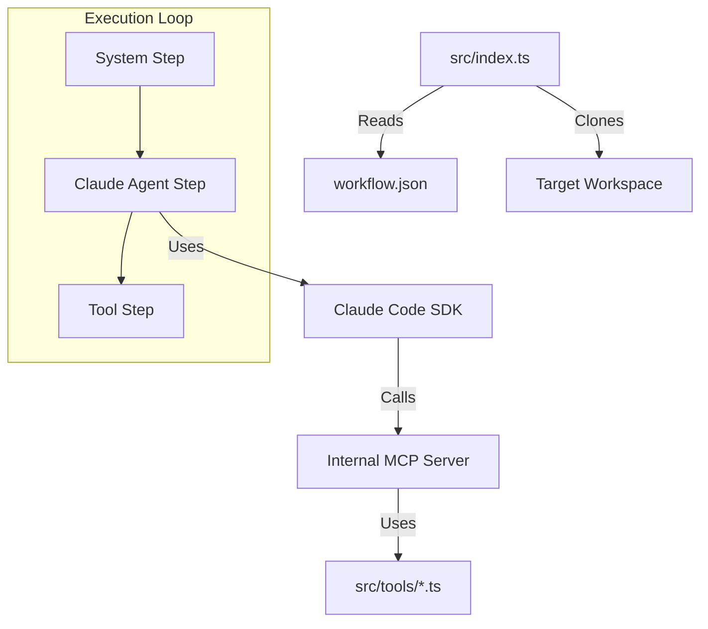

# Autonomous Agent Template

## Overview

This repository is a template for an **Autonomous Coding Agent**. It is designed to be deployed into a sandboxed environment (e.g., Blaxel, E2B, Fly.io) to perform complex, multi-step coding tasks on a target repository.

The core philosophy is **"Agent-as-Code"**:
1.  **Declarative Workflow**: The agent's logic is defined in `workflow.json`.
2.  **Specialized Runner**: `src/index.ts` is the engine that executes this workflow.
3.  **Tooling**: It includes a set of MCP (Model Context Protocol) tools to interact with external services (GitHub, Sentry, etc.).
4.  **Headless Claude**: It leverages the Claude Code SDK to perform intelligent coding tasks within the target codebase.

## Architecture



## Project Structure

*   `workflow.json`: The brain of the agent. Defines the triggers, inputs, and sequence of steps.
*   `src/index.ts`: The main entry point. Orchestrates the execution of the workflow.
*   `src/tools/`: MCP Plugins (Sentry, GitHub, Git) that give the agent capabilities.
*   `src/utils/`: Helpers for Git operations, workflow parsing, and the Claude SDK wrapper.
*   `src/types.ts`: TypeScript definitions for the plugin architecture.

## Developing & extending

### 1. Setup
```bash
npm install
```

### 2. Configuration
Create a `.env` file with the following secrets (required depending on your workflow):
```bash

# Authentication
GITHUB_TOKEN="ghp_..."
ANTHROPIC_API_KEY="sk-..."
SENTRY_AUTH_TOKEN="sntry_..."
```

### 3. Running Locally
To simulate a run locally:
```bash
npm run dev
```
This will execute the steps defined in `workflow.json` against the local `./workspace` directory (which it will create).

### 4. The Workflow Schema
The `workflow.json` file follows this structure:

```json
{
  "name": "Agent Name",
  "steps": [
    {
      "id": "unique_id",
      "type": "system | claude_code | tool",
      // ... step specific params
    }
  ]
}
```

**Step Types:**
*   **`system`**: Infrastructure tasks (e.g., `action: "clone"`).
*   **`claude_code`**: Runs the AI coding agent.
    *   `prompt`: What to ask the agent.
    *   `working_dir`: Where to run it.
*   **`tool`**: Directly calls a specific MCP tool function.

## Adding New Capabilities

### Adding a new Tool (MCP Plugin)
1.  Create a new file in `src/tools/` (e.g., `linear.ts`).
2.  Implement the `McpPlugin` interface (see `src/types.ts`).
3.  Register it in the `ClaudeCodeRunner` or the main `mcp-server` instance.

### Updating the Runner
If you need to add new step types (e.g., a "Human Approval" step), update the switch case in `src/index.ts`.

