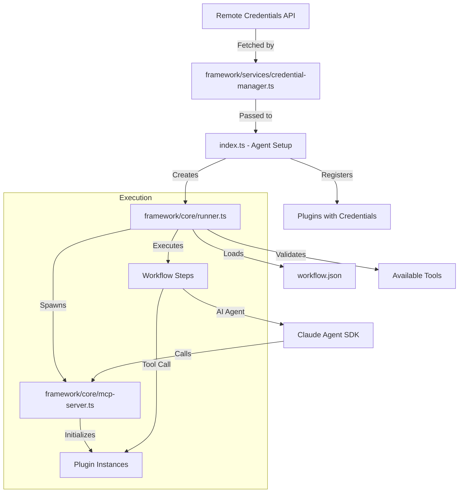

# Autonomous Agent Template

## Overview

This repository is a **template for creating Autonomous Coding Agents**. It is designed to be deployed into sandboxed environments (e.g., Blaxel, E2B, Fly.io) to perform complex, multi-step coding tasks on target repositories.

The core philosophy is **"Agent-as-Code"** with **strict separation between framework and agent logic**:

1. **Declarative Workflow**: Agent behavior is defined in `workflow.json`
2. **Generic Framework**: Core orchestration engine in `framework/` that never changes
3. **Explicit Plugin System**: Type-safe plugin registration with compile-time validation
4. **MCP Tools**: Plugins provide tools via Model Context Protocol
5. **Headless Claude**: Leverages Claude Agent SDK for intelligent coding tasks

## Architecture



## Directory Structure

```
autonomous-agent-template/
├── index.ts                    # AGENT-SPECIFIC: Plugin registration (MODIFY THIS)
├── workflow.json               # AGENT-SPECIFIC: Workflow definition (MODIFY THIS)
│
├── framework/                  # FRAMEWORK: Generic code (DON'T TOUCH)
│   ├── core/
│   │   ├── runner.ts          # Workflow orchestration engine
│   │   ├── mcp-server.ts      # MCP server for Claude Agent SDK
│   │   └── types.ts           # Core TypeScript interfaces
│   ├── services/
│   │   └── credential-manager.ts  # Remote credential fetching & decryption
│   └── utils/
│       ├── workflow.ts        # Workflow loading & types
│       ├── agent.ts           # Claude Agent SDK wrapper
│       └── git.ts             # Git utilities
│
├── tools/                      # PLUGINS: Tool library
│   ├── reusable/              # Can be shared across agents
│   │   ├── git.ts            # Generic git operations
│   │   ├── github.ts         # GitHub-specific operations
│   │   └── slack.ts          # Slack messaging & approval
│   └── agent-specific/        # Specific to this agent
│       └── sentry.ts         # Sentry issue tracking
│
└── agent/                      # DOCUMENTATION
    └── README.md              # Guide for creating new agents
```

## Key Architectural Principles

### 1. Framework vs Agent Separation

**Framework Code** (`framework/`):
- Generic orchestration logic
- Never contains agent-specific values
- Unchanged when creating new agents
- Type-safe and validated

**Agent Code** (`index.ts`, `workflow.json`):
- Plugin selection and initialization
- Workflow steps and configuration
- All agent-specific behavior
- Easy to modify per use case

### 2. Type-Safe Plugin System

Plugins have strongly-typed config interfaces:

```typescript
// Plugin definition (in tools/)
interface GitHubPluginConfig extends BasePluginConfig {
  GITHUB_TOKEN: string;  // Required credential
}

// Plugin registration (in index.ts)
await runner.registerPlugin(githubPlugin, {
  GITHUB_TOKEN: credentials.GITHUB_TOKEN!,  // TypeScript enforces this
});
```

**Benefits:**
- Compile-time validation of all required credentials
- IDE autocomplete for config keys
- No typos in credential names
- Self-documenting plugin requirements

### 3. Fail-Fast Validation

The runner validates configuration before execution:

```typescript
// Checks performed at startup:
1. All required credentials are present (plugins fail init if missing)
2. No duplicate tool names across plugins
3. All tools referenced in workflow.json are available
4. Workflow syntax is valid
```

**Output:**
```
🚀 Starting Autonomous Agent Runner...
✅ Credentials loaded
✅ Registered plugin: git
✅ Registered plugin: github
✅ Registered plugin: slack
✅ Registered plugin: sentry
📋 Loaded workflow
📦 Available tools: git_clone, github_clone, github_create_pr, slack_post_message, slack_wait_approval, sentry_get_issues, sentry_get_issue_details
✅ All workflow tools are available
```

### 4. Uniform Step Structure

All workflow steps use `args` for configuration:

```json
{
  "id": "clone_repo",
  "type": "tool",
  "tool": "github_clone",
  "args": {
    "repo_url": "https://github.com/owner/repo.git",
    "target_dir": "./workspace"
  }
}

{
  "id": "investigate",
  "type": "ai_agent",
  "args": {
    "prompt": "Analyze this issue: {{ issue.output }}",
    "working_dir": "./workspace"
  }
}
```

**No config section needed** - all configuration lives in step arguments!

## Core Features

### Remote Credential Management

**Centralized Service**: `framework/services/credential-manager.ts`

**How it works:**
1. Fetches encrypted credentials from remote API on startup
2. Decrypts using AES-256-GCM
3. Transforms provider-specific format to environment variables:
   - `github` provider → `GITHUB_TOKEN`
   - `slack` provider → `SLACK_BOT_TOKEN`
   - `sentry` provider → `SENTRY_AUTH_TOKEN`
4. Singleton instance ensures credentials fetched only once
5. Plugins initialized with credentials, fail fast if missing

**Configuration:**
- Endpoint: `https://phisdev.staging.build0.ai/api/service/agents/{agentId}/credentials`
- Authentication: `x-agent-auth-token` header
- Encryption: Hardcoded in `credential-manager.ts`
- Local fallback: `.env` file for `ANTHROPIC_API_KEY` only

### Session Continuity

AI agent steps maintain context across multiple steps:

```typescript
// First ai_agent step: Fresh session
shouldContinuePreviousSession: false

// Subsequent ai_agent steps: Continue session
shouldContinuePreviousSession: true
```

The runner automatically tracks this based on step order.

### Prompt Management

For large prompts:
1. Full prompt written to temporary file (`prompt_{step_id}.txt`)
2. Truncated to ~2000 tokens (8000 chars) for initial context
3. Note added referencing the full file
4. Agent can read full context from file if needed

### Variable Interpolation

Reference previous step outputs in any step argument:

```json
{
  "args": {
    "issue_id": "{{ fetch_issues.output.0.id }}",
    "analysis": "{{ investigate.output }}"
  }
}
```

Supports:
- Dot notation for nested access
- Automatic JSON stringification for objects
- Works in all `args` fields (tool and ai_agent)

## Creating a New Agent

### 1. Setup Environment

```bash
pnpm install
```

Create `.env` with only:
```bash
ANTHROPIC_API_KEY=sk-...
```

All other credentials come from remote API.

### 2. Modify `index.ts`

Register only the plugins you need:

```typescript
import { Runner } from "./framework/core/runner.js";
import { credentialManager } from "./framework/services/credential-manager.js";
import { githubPlugin } from "./tools/reusable/github.js";
import { slackPlugin } from "./tools/reusable/slack.js";

async function main() {
  // Fetch credentials
  await credentialManager.fetchCredentials();
  const credentials = credentialManager.getCredentials();

  // Create runner
  const runner = new Runner();
  runner.setCredentials(credentials);

  // Register plugins (TypeScript enforces config!)
  await runner.registerPlugin(githubPlugin, {
    GITHUB_TOKEN: credentials.GITHUB_TOKEN!,
  });

  await runner.registerPlugin(slackPlugin, {
    SLACK_BOT_TOKEN: credentials.SLACK_BOT_TOKEN!,
  });

  // Run workflow
  await runner.runWorkflow("workflow.json");
}
```

### 3. Define `workflow.json`

```json
{
  "steps": [
    {
      "id": "clone",
      "type": "tool",
      "tool": "github_clone",
      "args": {
        "repo_url": "https://github.com/owner/repo.git",
        "target_dir": "./workspace"
      }
    },
    {
      "id": "analyze",
      "type": "ai_agent",
      "args": {
        "prompt": "Review the codebase for issues",
        "working_dir": "./workspace"
      }
    }
  ]
}
```

### 4. Run

```bash
pnpm dev
```

## Available Tools

### Reusable Tools (`tools/reusable/`)

**Git Plugin** - Generic git operations:
- `git_clone` - Clone any repository (public or with SSH keys)

**GitHub Plugin** - GitHub-specific operations:
- `github_clone` - Clone private GitHub repo with token authentication
- `github_create_pr` - Create pull request

**Slack Plugin** - Slack integration:
- `slack_post_message` - Post message to channel
- `slack_wait_approval` - Wait for ✅ reaction (human-in-the-loop)

### Agent-Specific Tools (`tools/agent-specific/`)

**Sentry Plugin** - Sentry issue tracking:
- `sentry_get_issues` - Fetch issues from org/project
- `sentry_get_issue_details` - Get detailed issue info with stack traces

## Adding New Tools

### 1. Create Plugin File

Create `tools/agent-specific/my-tool.ts` or `tools/reusable/my-tool.ts`:

```typescript
import { McpPlugin, BasePluginConfig } from "../../framework/core/types.js";
import { Tool } from "@modelcontextprotocol/sdk/types.js";

interface MyPluginConfig extends BasePluginConfig {
  MY_API_KEY: string;  // Required credential
}

export const myPlugin: McpPlugin<MyPluginConfig> = {
  name: "my_plugin",
  config: {} as MyPluginConfig,

  async init(config: MyPluginConfig): Promise<void> {
    if (!config.MY_API_KEY) {
      throw new Error("My plugin requires MY_API_KEY credential");
    }
    this.config = config;
  },

  registerTools(): Tool[] {
    return [
      {
        name: "my_tool",
        description: "Does something useful",
        inputSchema: {
          type: "object",
          properties: {
            param1: { type: "string", description: "First parameter" },
          },
          required: ["param1"],
        },
      },
    ];
  },

  async handleToolCall(name, args) {
    if (name === "my_tool") {
      const apiKey = this.config!.MY_API_KEY!;
      const { param1 } = args as { param1: string };

      // Implement tool logic

      return {
        content: [{ type: "text", text: "Result" }],
      };
    }
    throw new Error(`Unknown tool: ${name}`);
  },
};
```

### 2. Register in `index.ts`

```typescript
import { myPlugin } from "./tools/agent-specific/my-tool.js";

await runner.registerPlugin(myPlugin, {
  MY_API_KEY: credentials.MY_API_KEY!,
});
```

### 3. Use in `workflow.json`

```json
{
  "id": "do_something",
  "type": "tool",
  "tool": "my_tool",
  "args": {
    "param1": "value"
  }
}
```

TypeScript will catch missing credentials at compile time!

## Example: Sentry Fix Agent

The included workflow demonstrates a complete autonomous fix cycle:

1. **Clone Repository** (`github_clone`) - Clones target repo with authentication
2. **Fetch Issues** (`sentry_get_issues`) - Gets top unresolved Sentry issue
3. **Get Details** (`sentry_get_issue_details`) - Fetches stack trace and context
4. **Investigate** (`ai_agent`) - Claude analyzes codebase to find root cause
5. **Request Approval** (`slack_post_message`) - Posts investigation to Slack
6. **Wait for Approval** (`slack_wait_approval`) - Polls for ✅ reaction
7. **Implement Fix** (`ai_agent`) - Claude creates fix, commits, pushes

All configuration (repo URL, Sentry org/project, Slack channel) lives in `workflow.json` args!

## Troubleshooting

### Credential Issues

**Error:** `Plugin requires GITHUB_TOKEN credential`

**Fix:**
1. Verify credential is fetched from remote API
2. Check `credential-manager.ts` configuration
3. Ensure credential transformation is correct
4. Verify plugin is registered with credential in `index.ts`

### Missing Tools

**Error:** `Workflow references tools that are not available: unknown_tool`

**Fix:**
1. Check tool name spelling in `workflow.json`
2. Verify plugin is registered in `index.ts`
3. Check plugin's `registerTools()` method
4. Review startup output for available tools

### Duplicate Tools

**Error:** `Duplicate tool name detected: "git_clone" is provided by both "git" and "github" plugins`

**Fix:**
1. Rename one of the tools
2. Remove duplicate plugin registration
3. Use only one plugin that provides the tool

### TypeScript Errors

**Error:** `Property 'GITHUB_TOKEN' is missing in type`

**Fix:**
1. Add missing credential to plugin config in `index.ts`
2. This is the type safety working correctly!
3. Ensures all required credentials are provided

### Workflow Validation

The runner validates workflows before execution:
- ✅ All tools exist
- ✅ No duplicate tools
- ✅ All credentials present
- ✅ Syntax is valid

Check startup logs for validation output.

## Best Practices

### 1. Keep Framework Generic

**Don't:**
- Add agent-specific logic to `framework/`
- Hardcode credentials or config in `framework/`
- Modify framework code when creating new agents

**Do:**
- Put all agent logic in `index.ts` and `workflow.json`
- Use plugin args for agent-specific values
- Keep framework reusable across all agents

### 2. Type Safety First

**Don't:**
- Use `any` types in plugin configs
- Skip credential validation
- Ignore TypeScript errors

**Do:**
- Define strict config interfaces
- Let TypeScript catch missing credentials
- Fail fast in `init()` if credentials missing

### 3. Tool Organization

**Reusable tools** (`tools/reusable/`):
- Generic functionality (Git, GitHub, Slack)
- No hardcoded agent-specific values
- Well-documented interfaces

**Agent-specific tools** (`tools/agent-specific/`):
- Specific to one use case (Sentry)
- Can have hardcoded URLs or constants
- Move to reusable if needed by other agents

### 4. Configuration Location

**In `index.ts`** (rarely changes):
- Which plugins to load
- Credential mapping

**In `workflow.json`** (changes per agent):
- What repos to clone
- What org/project to use
- What channels to post to
- What prompts to use

## Development

```bash
# Run in development mode
pnpm dev

# Type check
pnpm typecheck

# Build
pnpm build

# Run built version
pnpm start
```

## Deployment

The agent template is designed for serverless/sandboxed deployment:

1. **Build**: `pnpm build`
2. **Deploy**: Upload `dist/` to your environment
3. **Configure**: Set remote credential endpoint
4. **Run**: `node dist/index.js`

The agent will:
- Fetch credentials from remote API
- Validate configuration
- Execute workflow
- Clean up on completion

## Summary

This template provides a **production-ready foundation** for autonomous coding agents with:

✅ **Clear separation** - Framework vs agent code
✅ **Type safety** - Compile-time validation of all config
✅ **Fail-fast** - Errors caught before execution
✅ **Flexibility** - Easy to add new tools and agents
✅ **Security** - Remote credential management
✅ **Reliability** - Validation and diagnostics built-in

Create new agents by modifying only `index.ts` and `workflow.json`!
